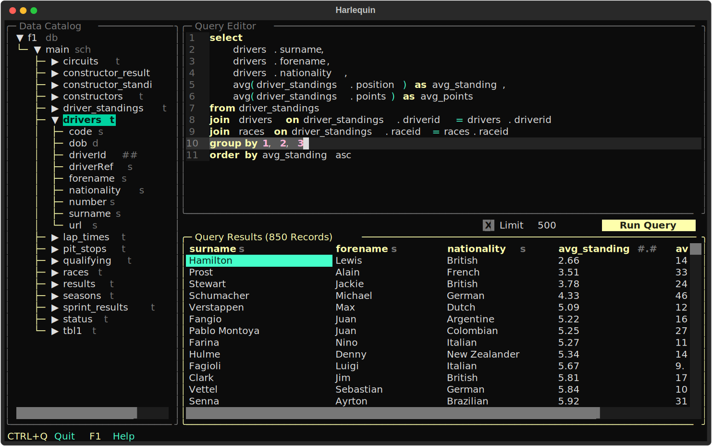

# Harlequin

[](https://pypi.org/project/harlequin/)


The SQL IDE for Your Terminal.



> [!TIP]
> This README contains a small subset of the docs available at
> [harlequin.sh](https://harlequin.sh/docs/getting-started/index).

## Installing Harlequin

Harlequin is a Python program, and there are many ways to install and run it. We strongly recommend using [uv](https://docs.astral.sh/uv):

1. [Install uv](https://docs.astral.sh/uv/getting-started/installation/#standalone-installer). From a POSIX shell, run:

   ```bash
   curl -LsSf https://astral.sh/uv/install.sh | sh
   ```

   Or using Windows Powershell:

   ```powershell
   powershell -ExecutionPolicy ByPass -c "irm https://astral.sh/uv/install.ps1 | iex"
   ```

2. Install Harlequin as a tool using `uv`:

   ```bash
   uv tool install harlequin
   ```

   This command will install Harlequin into an isolated environment and add it to your PATH so you can easily run the executable.

### Other Installation Methods

Alternatively, if you know what you're doing, after installing Python 3.9 or above, install Harlequin using `pip`, `pipx`, `poetry`, or any other program that can install Python packages from PyPI:

```bash
pip install harlequin
```

There is also a [Homebrew formula](https://formulae.brew.sh/formula/harlequin) for Harlequin, although this is maintained by the community and is not as rigorously tested as the Python installations. Note that the formula includes several Harlequin adapter packages (Postgres, MySQL/MariaDB, and ODBC) and their dependencies, which is convenient but increases the application size.

```bash
brew install harlequin
```

## Installing Database Adapters

Harlequin can connect to dozens of databases using adapter plug-ins. Adapters are distributed as their own Python packages that need to be installed into the same environment as Harlequin.

For a list of known adapters provided either by the Harlequin maintainers or the broader community, see the [adapters](https://harlequin.sh/docs/adapters) page.

The adapter docs also include installation instructions. Some adapters can be installed as Harlequin extras, like `postgres`. If you used `uv` to install Harlequin:

```bash
uv tool install 'harlequin[postgres]'
```

You can install multiple extras:

```bash
uv tool install 'harlequin[postgres,mysql,s3]'
```

## Running Harlequin

Once Harlequin is installed, you run it from the command line. The arguments and options you pass in at the command line affect Harlequin's behavior, like what database adapter it uses, which database it connects to, whether or not the file picker is visible, and more. Assuming you have installed Harlequin so that it is on your [PATH](<https://en.wikipedia.org/wiki/PATH_(variable)>) (`uv tool install harlequin` does this automatically), you run Harlequin by typing a command of this form into your shell:

```bash
harlequin [OPTIONS] [CONN_STR]
```

where `[OPTIONS]` is 0 or more pairs of the form `--[option-name] [option-value]`, and `[CONN_STR]` is 0 or more connection strings. `[OPTIONS]` are composed of both Harlequin options and adapter options. For a full list of options, run Harlequin with the `--help` option:

```bash
harlequin --help
```

## Using Harlequin with DuckDB

Harlequin defaults to using its DuckDB database adapter, which ships with Harlequin and includes the full DuckDB in-process database.

To open an in-memory DuckDB session, run Harlequin with no arguments:

```bash
harlequin
```

To open one or more DuckDB database files, pass in relative or absolute paths as connection strings (Harlequin will create DuckDB databases if they do not exist):

```bash
harlequin "path/to/duck.db" "another_duck.db"
```

If you want to control the version of DuckDB that Harlequin uses, see the [Troubleshooting](https://harlequin.sh/docs/troubleshooting/duckdb-version-mismatch) page.

## Using Harlequin with SQLite and Other Adapters

Harlequin also ships with a SQLite3 adapter. To use that adapter, you specify the `--adapter sqlite` option. Like DuckDB, you can open an in-memory SQLite database by omitting the connection string:

```bash
harlequin --adapter sqlite
```

You can open one or more SQLite database files by passing in their paths as connection strings; note that the `--adapter` option has a short alias, `-a`:

```bash
harlequin -a sqlite "path/to/sqlite.db" "another_sqlite.db"
```

Other adapters can be installed as plug-ins; for more information, see the [installation guide](https://harlequin.sh/docs/getting-started/index#installing-database-adapters), and the guides for individual [adapters](https://harlequin.sh/docs/adapters). Each adapter can define its own options, which you can view using `harlequin --help`.

## Configuring Harlequin

Harlequin contains a large number of options that allow you to [set the theme](https://harlequin.sh/docs/themes), [customize key bindings](https://harlequin.sh/docs/keymaps/index), [show remote and local files](https://harlequin.sh/docs/files/index), set the locale for number formatting, and much more. These can always be entered at the command line, but it can be convenient to define a configuration as a profile instead. For more information on configuring Harlequin, see [Using Config Files](https://harlequin.sh/docs/config-file/index).

## Using Harlequin with Django

[django-harlequin](https://pypi.org/project/django-harlequin/) provides a command to launch Harlequin using Django’s database configuration, like:

```bash
./manage.py harlequin
```

## Keep Reading at [harlequin.sh](https://harlequin.sh/docs/getting-started/usage)

Visit [harlequin.sh](https://harlequin.sh/docs/getting-started/usage) for an overview of features and full documentation, starting with a guided walkthrough of how to edit and execute queries, use the data catalog, export data, and more.

## Getting Help

To view all command-line options for Harlequin and all installed adapters, after installation, simply type:

```bash
harlequin --help
```

To view a subset of these docs (and a link back here) from within the app, press <Key>F1</Key>.

See the [Troubleshooting](https://harlequin.sh/docs/troubleshooting/index) guide for help with key bindings, appearance issues, copy-paste, etc.

[GitHub Discussions](https://github.com/tconbeer/harlequin/discussions) are a good place to ask questions, request features, and say hello.

[GitHub Issues](https://github.com/tconbeer/harlequin/issues) are the best place to report bugs.

## Sponsoring Harlequin

Please consider [sponsoring Harlequin's author](https://github.com/sponsors/tconbeer), so he can continue to dedicate time to Harlequin.

## Contributing

Thanks for your interest in Harlequin! Harlequin is primarily maintained by [Ted Conbeer](https://github.com/tconbeer), but he welcomes all contributions!

Please see [`CONTRIBUTING.md`](./CONTRIBUTING.md) for more information.
