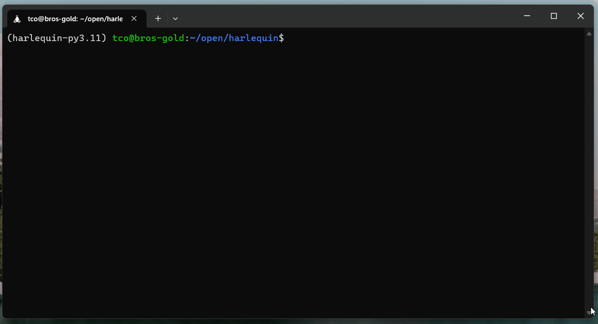

# harlequin
A Terminal-based SQL IDE for DuckDB.



(A Harlequin is also a [pretty duck](https://en.wikipedia.org/wiki/Harlequin_duck).)


## Installing Harlequin

After installing Python 3.8 or above, install Harlequin using `pip` or `pipx` with:

```bash
pipx install harlequin
```

> **Tip:**
>
> You can run invoke directly with [`pipx run`](https://pypa.github.io/pipx/examples/#pipx-run-examples) anywhere that `pipx` is installed. For example:
> - `pipx run harlequin --help`
> - `pipx run harlequin ./my.duckdb`


## Using Harlequin

From any shell, to open one or more DuckDB database files:

```bash
harlequin "path/to/duck.db" "another_duck.db"
```

To open an in-memory DuckDB session, run Harlequin with no arguments:

```bash
harlequin
```

You can also open a database in read-only mode:

```bash
harlequin -r "path/to/duck.db"
```

### Using Harlequin with MotherDuck

You can use Harlequin with MotherDuck, just as you would use the DuckDB CLI:

```bash
harlequin "md:"
```

You can attach local databases as additional arguments (`md:` has to be first:)

```bash
harlequin "md:" "local_duck.db"
```

#### Authentication Options

1. Web browser: Run `harlequin "md:"`, and Harlequin will attempt to open a web browser where you can log in.
2. Use an environment variable: Set the `motherduck_token` variable before running `harlequin "md:"`, and Harlequin will authenticate with MotherDuck using your service token.
3. Use the CLI option: You can pass a service token to Harlequin with `harlequin "md:" --md_token <my token>`

#### SaaS Mode

You can run Harlequin in ["SaaS Mode"](https://motherduck.com/docs/authenticating-to-motherduck#authentication-using-saas-mode) by passing the `md_saas` option: `harlequin "md:" --md_saas`.

### Viewing the Schema of your Database

When Harlequin is open, you can view the schema of your DuckDB database in the left sidebar. You can use your mouse or the arrow keys + enter to navigate the tree. The tree shows schemas, tables/views and their types, and columns and their types.

### Editing a Query

The main query editor is a full-featured text editor, with features including syntax highlighting, auto-formatting with ``ctrl + ` `` (`ctrl + 2` on some terminals), text selection, copy/paste, and more.

You can save the query currently in the editor with `ctrl + s`. You can open a query in any text or .sql file with `ctrl + o`.

### Running a Query and Viewing Results

To run a query press `ctrl + enter`. Not all terminals support this key combination, so you can also use `ctrl + j`, or click the `RUN QUERY` button in the (blue) footer.

Up to 50k records will be loaded into the results pane below the query editor. When the focus is on the data pane, you can use your arrow keys or mouse to select different cells.

### Exiting Harlequin

Press `ctrl + q` to quit and return to your shell.

## Contributing

Thanks for your interest in Harlequin! Harlequin is primarily maintained by [Ted Conbeer](https://github.com/tconbeer), but he welcomes all contributions and is looking for additional maintainers!

### Providing Feedback

We'd love to hear from you! [Open an Issue](https://github.com/tconbeer/harlequin/issues/new) to request new features, report bugs, or say hello.

### Setting up Your Dev Environment and Running Tests

1. Install Poetry v1.2 or higher if you don't have it already. You may also need or want pyenv, make, and gcc.
1. Fork this repo, and then clone the fork into a directory (let's call it `harlequin`), then `cd harlequin`.
1. Use `poetry install --sync` to install the project (editable) and its dependencies (including all test and dev dependencies) into a new virtual env.
1. Use `poetry shell` to spawn a subshell.
1. Type `make` to run all tests and linters, or run `pytest`, `black .`, `ruff . --fix`, and `mypy` individually.

### Opening PRs

1. PRs should be motivated by an open issue. If there isn't already an issue describing the feature or bug, [open one](https://github.com/tconbeer/harlequin/issues/new). Do this before you write code, so you don't waste time on something that won't get merged.
2. Ideally new features and bug fixes would be tested, to prevent future regressions. Textual provides a test harness that we use to test features of Harlequin. You can find some examples in the `tests` directory of this project. Please include a test in your PR, but if you can't figure it out, open a PR to ask for help.
2. Open a PR from your fork to the `main` branch of `tconbeer/harlequin`. In the PR description, link to the open issue, and then write a few sentences about **why** you wrote the code you did: explain your design, etc.
3. Ted may ask you to make changes, or he may make them for you. Don't take this the wrong way -- he values your contributions, but he knows this isn't your job, either, so if it's faster for him, he may push a commit to your branch or create a new branch from your commits.
